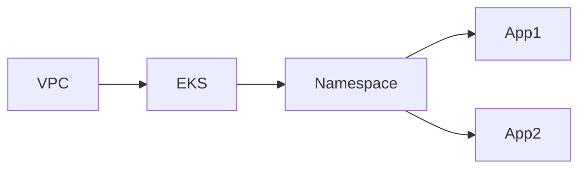

<p align="center">
  <picture width="160px" align="center">
      <source media="(prefers-color-scheme: dark)" srcset="https://raw.githubusercontent.com/terramate-io/brand/5a799813d429116741243b9b06a9f034a3991bf3/darkmode/stamp.svg">
      
    </picture>
  <h1 align="center">Terramate AWS Quickstart Guide</h1>
  <p align="center">
    ✨ <a href="https://terramate.io/docs/cli">https://terramate.io</a> ✨
    <br/>
  </p>
</p>
<br/>

<p align="center">
  <a href="https://terramate.io/discord" rel="nofollow"></a>
</p>
<p align="center">
  <a href="https://terramate.io/docs">📖 Terramate Docs</a> | <a href="https://terramate.io/docs/cli/getting-started">🚀 Getting Started</a> | <a href="https://play.terramate.io">💻 Playground</a> | <a href="https://jobs.ashbyhq.com/terramate" title="Terramate Job Board">🙌 Join Us</a>
</p>

<br>
<br>

## Introduction

This template provides a pre-configured **Terramate** project for **Terraform** (or OpenTofu) on **AWS** using best practices. It includes GitOps workflows in GitHub Actions, DRY code generation for stacks, and support for multiple environments. Use it to orchestrate Terraform, clone or create stacks, and automate plans and applies in Pull Requests.

### Features

- **GitOps for Terraform with GitHub Actions**: Pre-configured GitHub Action GitOps workflows using merge-and-apply strategy with drift detection and reconciliation.
- **Recommended Project Structure**: Best practice project structure with environment-based organization (stg, prd).
- **Change Preview in Pull Requests**: Preview and approval of plans in Pull Requests to review and approve changes before deploying.
- **DRY Terraform Stacks**: Generate Terraform provider and backend configuration in stacks via mixins and generators.
- **OpenID Connect (OIDC)**: Allows GitHub Actions workflows to access AWS resources without storing long-lived GitHub secrets.
- **Terraform S3 Remote State Backend**: Terraform Remote State Storage and State Locking with AWS S3 and DynamoDB.
- **Terramate Cloud Integration**: Pushes data to Terramate Cloud for observability, asset management, drift management, and Slack notifications.
- **Multi-Environment Support**: Built-in support for staging and production environments with separate AWS accounts.
- **Drift Detection and Reconciliation**: Automated drift detection and reconciliation workflows to maintain infrastructure consistency.

### AWS Architecture

This template creates a complete AWS infrastructure with the following components:

1. **VPC (Virtual Private Cloud)**
   - A dedicated network space for your infrastructure
   - Public and private subnets across multiple availability zones
   - NAT Gateway for outbound internet access from private subnets
   - Internet Gateway for inbound internet access to public subnets

2. **EKS (Elastic Kubernetes Service)**
   - A managed Kubernetes cluster in auto-mode
   - Node groups for running your containerized applications
   - Auto-scaling capabilities based on workload demand
   - Integration with AWS IAM for authentication and authorization

3. **Sample Applications**
   - Two sample web applications deployed in the EKS cluster
   - Applications are accessible via LoadBalancer services
   - Demonstrates best practices for Kubernetes deployments

The infrastructure is designed to be highly available across multiple availability zones, secure with proper network isolation, and scalable with clear separation of concerns.

---

## Repository Structure

The project is organized as follows:

```
terramate-quickstart-aws/
├── config.tm.hcl              # Root: Terraform version, backend, providers, OIDC
├── imports.tm.hcl             # Imports mixins and generators
├── terramate.tm.hcl          # Project config: cloud, git, experiments
├── workflows.tm.hcl          # Root-level Terramate scripts
├── imports/
│   ├── mixins/               # Shared code-gen: backend, providers, Kubernetes auth
│   │   ├── backend.tm.hcl
│   │   ├── terraform.tm.hcl
│   │   └── kubernetes.tm.hcl
│   └── generators/           # Path-filtered code-gen: VPC, EKS, namespace, apps
│       ├── generate_vpc.tm.hcl
│       ├── generate_eks.tm.hcl
│       ├── generate_apps_namespace.tm.hcl
│       └── generate_app.tm.hcl
├── stacks/
│   ├── terraform/
│   │   ├── workflows.tm.hcl  # init, preview, deploy, drift scripts
│   │   └── envs/
│   │       ├── stg/         # Staging: config.tm.hcl, vpc/, eks/, eks/apps/
│   │       └── prd/         # Production (same structure)
│   ├── opentofu/            # OpenTofu example stacks
│   └── ...
└── _bootstrap/              # One-time: state bucket, OIDC provider
    ├── terraform-state-bucket/
    └── oidc-aws-github/
```

**Key directories:**

- **`config.tm.hcl`** (root) — Global defaults: Terraform version, S3 backend, AWS/Kubernetes providers, OIDC GitHub repos.
- **`imports.tm.hcl`** — Declares imports for `imports/mixins/*.tm.hcl` and `imports/generators/*.tm.hcl`.
- **`imports/mixins/`** — Generate `backend.tf`, `terraform.tf`, and (for stacks with `kubernetes` tag) `kubernetes.tf` in every stack.
- **`imports/generators/`** — Generate VPC, EKS, namespace, and app Terraform in stacks matching path patterns (see [How Code Generation Works](#how-code-generation-works)).
- **`stacks/terraform/envs/{stg,prd}/`** — Environment-specific stacks. Each env has a `config.tm.hcl` (env name, VPC CIDR, EKS cluster name, etc.) and sub-stacks: `vpc/`, `eks/`, `eks/apps/`, `eks/apps/app1/`, `eks/apps/app2/`.
- **`stacks/opentofu/`** — Example OpenTofu stacks with their own version and backend key in `stacks/opentofu/config.tm.hcl`.
- **`_bootstrap/`** — Bootstrap stacks for the S3 state bucket and GitHub OIDC; use local state initially, then migrate to S3.
- **`workflows.tm.hcl`** (root) and **`stacks/terraform/workflows.tm.hcl`** — Terramate script definitions. Staging also has **`stacks/terraform/envs/stg/workflows.tm.hcl`** with the `promote` script.

Stacks are deployed in a fixed order: VPC → EKS cluster → apps namespace → application stacks. EKS stacks use `after = ["tag:vpc"]` so the VPC is applied first.



---

## How Code Generation Works

This repo keeps stacks **DRY** by generating Terraform files from Terramate config and globals. You define stack metadata and globals; Terramate generates the actual `.tf` (and some `_*.tf`) files.

**Two mechanisms:**

1. **Generators** (`imports/generators/*.tm.hcl`) — Use `generate_hcl` with `stack_filter.project_paths` to emit specific files only into stacks whose path matches. For example:
   - **`generate_vpc.tm.hcl`** — Targets `**/envs/*/vpc`, generates `main.tf` (VPC module) from `global.vpc.*`.
   - **`generate_eks.tm.hcl`** — Targets `**/envs/*/eks`, generates `main.tf` and `data.tf` from `global.eks.*`.
   - **`generate_apps_namespace.tm.hcl`** — Targets `**/envs/*/eks/apps`, generates `namespace.tf`.
   - **`generate_app.tm.hcl`** — Targets `**/envs/*/eks/apps/*`, generates `main.tf` (Deployment + LoadBalancer Service) from `global.app.*` (e.g. `image`, `container_name`, `container_port`).

2. **Mixins** (`imports/mixins/*.tm.hcl`) — Generate shared plumbing in (almost) all stacks: `backend.tm.hcl` → `backend.tf`, `terraform.tm.hcl` → `terraform.tf`, and `kubernetes.tm.hcl` → `kubernetes.tf` only for stacks with the `kubernetes` tag.

**Workflow:**

- Run **`terramate generate`** to (re)generate all such files. After changing `config.tm.hcl`, stack paths, or generator/mixin logic, run it again.
- **Do not edit generated files by hand** — they are overwritten by `terramate generate`. Edit only `stack.tm.hcl`, `config.tm.hcl`, and the generator/mixin sources.

Example: adding a new app stack under `stacks/terraform/envs/stg/eks/apps/app3/` with a `config.tm.hcl` that sets `globals "app" { image = "..."; container_name = "..."; container_port = 8080; }` will, after `terramate generate`, get `main.tf` from `generate_app.tm.hcl` and `backend.tf` / `terraform.tf` / `kubernetes.tf` from the mixins (because of the `kubernetes` tag).

---

## Getting Started

### 1. Create a repository from this template

Click **Use this template** on GitHub to create your own repository, then clone it.

### 2. Prerequisites

1. **Install [asdf](https://asdf-vm.com/guide/getting-started.html).**

2. **Install plugins and tools** (versions are in `.tool-versions`):

   ```bash
   asdf plugin add terramate && \
   asdf plugin add terraform && \
   asdf plugin add opentofu && \
   asdf plugin add pre-commit && \
   asdf install
   ```

3. **AWS credentials** (for bootstrapping and local runs): Use one of the [AWS provider authentication methods](https://registry.terraform.io/providers/hashicorp/aws/latest/docs#authentication-and-configuration). We recommend [aws-vault](https://github.com/99designs/aws-vault).

4. **Pre-commit (optional but recommended):**

   ```bash
   pre-commit install
   ```

   Hooks keep Terramate and Terraform formatting and generation in sync when you commit.

### 3. Configure Terraform State Bucket and OIDC (bootstrap)

1. **Root config** — In the repo root, edit **`config.tm.hcl`**:
   - Set your S3 state bucket name and region under `globals "terraform" "backend"`.
   - Set your GitHub repo(s) under `globals "aws" "oidc" "github_repositories"`.

2. **Generate and deploy bootstrap stacks:**

   ```bash
   terramate generate
   terramate run -C _bootstrap terraform init
   terramate run -C _bootstrap terraform apply
   ```

3. **Migrate bootstrap state to S3:** Remove `tags = ["no-backend"]` from the `stack.tm.hcl` in `_bootstrap/oidc-aws-github` and `_bootstrap/terraform-state-bucket`, then:

   ```bash
   terramate generate
   terramate run -C _bootstrap terraform init
   ```

   Terraform will migrate existing state into the new backend.

### 4. Terramate Cloud (optional)

1. Go to [Terramate Cloud](https://app.terramate.io), sign up or log in, and create an organization.
2. Set `terramate.config.cloud` in **`terramate.tm.hcl`** to your organization (and region if needed).
3. Optionally configure Slack under Integrations for notifications.

---

## Day-to-Day Developer Workflows

### Cloning an environment with `terramate clone`

To create a new environment (e.g. `dev`) by copying an existing one (e.g. `stg`):

```bash
terramate clone stacks/terraform/envs/stg stacks/terraform/envs/dev
```

**What this does:** Duplicates the stack tree under `stg` into `dev` and assigns **new stack IDs** to the cloned stacks (so they are independent stacks with their own state).

**Next steps:**

1. **Adjust environment config** — Edit `stacks/terraform/envs/dev/config.tm.hcl`:
   - Set `globals "terraform" { env = "dev" }`.
   - Change VPC name, CIDR, subnets, EKS cluster name, namespace, etc. so they don’t conflict with stg/prd.

2. **Regenerate code:**

   ```bash
   terramate generate
   ```

3. **Commit and push** (and add the new env to CI if you use a matrix over environments).

You can then run init/preview/deploy against `stacks/terraform/envs/dev` the same way as for `stg` or `prd`.

### Creating a new application stack

To add a new app (e.g. `app3`) in staging:

1. **Create the stack** (and give it a name, description, and the `kubernetes` tag so it gets the Kubernetes provider and app generator):

   ```bash
   terramate create stacks/terraform/envs/stg/eks/apps/app3 \
     --name "my-new-app-stg" \
     --description "My new application" \
     --tags kubernetes
   ```

2. **Add app configuration** — Create `stacks/terraform/envs/stg/eks/apps/app3/config.tm.hcl`:

   ```hcl
   globals "app" {
     image          = "your-registry/your-image:tag"
     container_name = "my-app"
     container_port = 8080
   }
   ```

   You can also set `replicas`, `resources.requests`, etc. if your generator supports them.

3. **Generate Terraform files:**

   ```bash
   terramate generate
   ```

   The generators and mixins will produce `main.tf` (from `generate_app.tm.hcl`), `backend.tf`, `terraform.tf`, and `kubernetes.tf` in the new stack. No need to copy these by hand.

4. **Plan and apply** (locally or via CI) for the changed stacks, e.g.:

   ```bash
   terramate script run -C stacks/terraform/envs/stg init
   terramate script run -C stacks/terraform/envs/stg preview
   terramate script run -C stacks/terraform/envs/stg deploy
   ```
**
### Promoting staging to production

After validating changes in staging, sync stack layout and generated code to production using the **promote** script defined in `stacks/terraform/envs/stg/workflows.tm.hcl`:

1. **From the staging env directory:**

   ```bash
   cd stacks/terraform/envs/stg
   terramate script run promote
   ```

   The script runs in each stack under `stg` and, for the corresponding path under `prd`:
   - Creates the prd stack with `terramate create` if it doesn’t exist.
   - Rsyncs files from stg to prd **excluding** `stack.tm.hcl` and `config.tm.hcl` (so prd keeps its own IDs and config).
   - Runs `terramate generate` under the prd path so generated `.tf` files match prd’s config.

2. **Review and commit** the resulting changes under `stacks/terraform/envs/prd`, then merge. CI will apply prd when you deploy.

> **Note:** The promote script is intended to be run from within `stacks/terraform/envs/stg`. Run it from each stack context (or as designed in the script) so each stg stack promotes to its prd counterpart.

### Running Terraform locally

From the repo root:

```bash
# Initialize all stacks under an environment
terramate script run -C stacks/terraform/envs/stg init

# Preview (plan) changed stacks
terramate script run -C stacks/terraform/envs/stg preview

# Deploy (plan + apply) changed stacks
terramate script run -C stacks/terraform/envs/stg deploy
```

Use `-C stacks/terraform/envs/prd` (or `dev`) for another environment. Scripts are defined in `stacks/terraform/workflows.tm.hcl`.

---

## Available Terramate Scripts

Defined in **`stacks/terraform/workflows.tm.hcl`** (and **`stacks/terraform/envs/stg/workflows.tm.hcl`** for `promote`). See [Terramate Scripts](https://terramate.io/docs/cli/scripts/).

| Script | Description |
|--------|-------------|
| `init` | Terraform init (backend + providers) |
| `preview` | Terraform validate + plan; syncs preview to Terramate Cloud |
| `deploy` | Terraform validate + plan + apply; syncs deployment to Terramate Cloud |
| `drift detect` | Plan for drift and sync status to Terramate Cloud |
| `drift reconcile` | Apply `drift.tfplan` to reconcile drift |
| `terraform render` | Show Terraform plan output (e.g. for PR comments) |
| `promote` | (Staging only) Sync stg stacks to prd and run generate |

Run with:

```bash
terramate script run -C <path> <script_name>
# e.g. terramate script run -C stacks/terraform/envs/stg deploy
```

---

## GitHub Actions Workflows

Workflows live in **`.github/workflows/`**. They use a matrix over environments (e.g. stg, prd) and AWS OIDC for authentication.

| Workflow | Trigger | Purpose |
|----------|---------|---------|
| **Preview** (`preview.yml`) | Pull requests to main | Format checks, `terramate generate`, init + plan on changed stacks; syncs preview to Terramate Cloud |
| **Deploy** (`deploy.yml`) | Push to main | Init + deploy (plan + apply) for changed stacks; runs drift detect after apply |
| **Drift Detection** (`drift-detection.yml`) | Manual / schedule | Init all stacks, drift detect, optionally reconcile stacks with `reconcile` tag |

---

## Terramate Cloud Integration

- **Preview** and **Deploy** scripts sync plan/deployment data to Terramate Cloud when `terramate.config.cloud` is set in `terramate.tm.hcl`.
- Use Terramate Cloud for stack overview, drift status, and (optional) Slack notifications. Configure the organization and Slack under your Cloud account settings.

---

## Key Files Reference

| File | Purpose |
|------|---------|
| `config.tm.hcl` (root) | Global Terraform version, backend, providers, OIDC repos |
| `imports.tm.hcl` | Import declarations for mixins and generators |
| `terramate.tm.hcl` | Project config: required_version, cloud, git, run env, experiments |
| `workflows.tm.hcl` (root) | Root-level Terramate scripts |
| `stacks/terraform/workflows.tm.hcl` | init, preview, deploy, drift, terraform render scripts |
| `stacks/terraform/envs/stg/config.tm.hcl` | Staging env: terraform.env, vpc, eks, namespace globals |
| `stacks/terraform/envs/stg/workflows.tm.hcl` | Promote script (stg → prd) |
| `stacks/terraform/envs/prd/config.tm.hcl` | Production env config |
| `stacks/opentofu/config.tm.hcl` | OpenTofu version and backend key overrides |
| `imports/generators/*.tm.hcl` | Code generators (VPC, EKS, namespace, app) |
| `imports/mixins/*.tm.hcl` | Backend, Terraform block, Kubernetes provider mixins |
